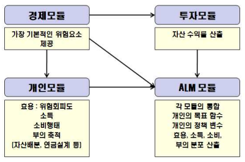

# 연금제도 간 효과적인 역할 분담 방안 연구

한국재무학회 / 정병욱(서울시립대학교 교수), 김범(숭실대학교 교수), 이재현(숭실대학교 교수)

## 제1장 서론

### 1. 연구의 필요성 및 목적

- 우리나라는 국민의 안정적 노후보장을 위해, 공적연금인 국민연금('88년 도입), 기업차원의 퇴직연금('05년), 그리고 민간주도의 개인연금('94년)의 3층 보장체계를 운영 중
  - 국민연금, 퇴직연금, 개인연금의 3층 보장체계가 갖추어졌음에도 불구하고 개별 연금제도의 현실을 고려해볼 때 완전한 노후보장체계가 갖추어졌다고 보기는 힘든 상황임
  - 개별 연금제도의 관련성을 고려한 연금제도를 정립하는 연구는 미비함
- 본 연구는
  1) 다층사회보장 연금체계의 전반적 현황을 조사 분석하고 국민연금, 퇴직연금 및 개인연금의 종합적 역할 및 문제점을 파악
  2) 연금 다층체계의 종합적 측면에서의 문제점을 다양한 각도에서 살펴보고 현재 논의되고 있는 연금 개편안들을 검토
  3) 시뮬레이션을 통해 다양한 개편안의 유효성을 파악
  4) 시뮬레이션을 통해 도출된 결과를 바탕으로 연금제도의 제도적 보완 방안을 도출
- 특히, 공적연금제도인 국민연금제도의 개혁은 제한적이라고 판단되며, 민간차원의 자발적인 연금제도인 개인연금제도를 국가정책으로 관리하는 문제점이 지적될 수 있는 상황을 고려해 볼 때, 현시점에서는 퇴직연금의 발전 방향을 제시하여 연금제도의 올바른 정립을 도모하는 것이 필요한 시점임
- 다음과 같은 퇴직연금의 역할에 대한 분석이 요구됨
  - 퇴직연금의 가교 연금(bridge pension)으로서 기능이 필요한지 여부
  - 현재 대부분 일시금으로 퇴직연금의 수급이 이루어지고 있는데, 어떠한 연금화 방안이 적절한지 방안을 탐구
  - 55세 이후 연령대별 소득대체율이 어느 수준까지 가능하며 퇴직연금이 어느 정도까지 기여할 수 있는지

## 제2장 다층사회보장 연금체계의 전반적 현황

### 1. 우리나라의 노후소득보장 체계

- 우리나라의 노후소득보장 체계는 공적연금인 1층, 퇴직연금 2층, 개인연금인 3층을 기본으로 구성되며, 추가적으로 기초사회보장제도로서의 0층 및 사적영역인 4,5층을 포함
  - 0층: 기초생활보장급여와 기초노령연금
  - 1층: 공적연금
  - 2층: 퇴직연금
  - 3층: 개인연금
  - 4층: 은퇴 후의 근로활동, 사적 이전
  - 5층: 자산소득, 자산처분(역모기지)
- 우리나라는 공적연금인 국민연금의 소득대체율이 상대적으로 낮고, 아직 퇴직연금의 소득대체율이 높지 않음

### 2. 1층 공적연금제도

- 우리나라의 공적연금제도는 크게 국민연금과 특수직역연금으로 구성됨
  - 국민연금
  - 공무원연금, 군인연금, 사립학교교직원연금
- 국민연금제도는 1988년 10인 이상 사업장에 근무하는 18세 이상 60세 미만 근로자 및 사업주를 대상으로 시행  

#### 2.1 공적연금제도의 적용 및 가입자 현황

- 2010년 12월 현재 기준
  - 18~59세 인구 3255.7만명
  - 공적연금 적용자 2062.1만명
    - 국민연금 1922.9만명, 특수직역연금 139.3만명
- 1988년말 기준 가입자는 약 443.2만명 → 2005년 5월말 기준 2593.9만명
  - 경제활동인구의 77.3%

#### 2.2 공적연금의 수급자 현황

- 국민연금 수급자 수: 1988년 28.2만명 → 2012년 311.0만명
- 국민연금의 향후 20~30년 후 가입자 대비 수급자 비율이 약 30% 수준에 달할 것으로 보임
- 10 ~ 20만원 규모의 월급여 수급자가 98.0만명으로 가장 많고, 20 ~ 30만원 규모 수급자가 62.4만명, 30 ~ 40만원 규모의 수급자가 32.0만명
  - 10 ~ 40만원 규모의 월급여 수급자가 전체 국민연금 수급자의 약 75% 이상을 차지
- 국민연금제도만으로는 노후의 소득보장이 전면적으로 이루어지기는 어려운 상황

#### 2.3 수급시의 평균 소득대체율에 대한 선행 연구

- 강성호, 이지은 "국민연금의 노후소득보장 수준연구(2010)"
  - 개인 소득대체율 31.8%
  - 가구주 소득대체율 26.5%
- 김대환, 오병국 "국민연금의 실질소득대체율과 정책적 시사점(2011)
  - 국민연금제도의 실질소득대체율은 약 25.8~30.7%

#### 2.4 국민연금 기금 현황 및 운용

- 사업장의 국민연금 강제적용으로 인해 국민연금의 징수율은 제도 초창기부터 줄곧 90% 후반이 이를 정도로 높음
- 국민연금기금액: 2004년말 155.4조원 → 2012년5월 411.5조원
  - 기금액의 68.8%는 연금보험료, 31.1%는 운용수익

#### 2.5 국민연금제도의 한계 및 문제점

- 국민연금제도의 한계
  - 근로자의 절대다수가 가입되어 있음에도 불구하고 도입시부터 후한 연금급여에 비해 매우 낮은 수준의 보험료를 납부하도록 설계되어 연금상품의 원칙인 수지균형이 맞지 않아 결국에는 재정적인 보전이 불가피한 구조
  - 기대여명이 폭발적으로 증가하고 출산율은 급감하고 있는 인구구조 추세와 경제위기에 따른 근무연한의 축소 및 취업난으로 인한 실업자의 증가는 연금기금의 고갈 및 불안정성에 대한 우려를 증촉
- 보험료율의 상향조정 및 급부금의 하향조정 등은 독일이나 일본 등 외국의 사례에서도 한계가 있음을 발견하였기에, 현재의 급부금에서 소득비례부분과 균등부분을 구분하여 공적연금의 비중을 줄이고 사적연금의 역할을 확대하는 방안을 고려하는 것이 세계적인 공적연금개혁의 추세

### 3. 2층 퇴직연금제도

- 2005년 12월 1일부터 시행
- 금융기관에 매년 퇴직금 해당금액을 적립하여 근로자가 퇴직할 때 연금 또는 일시금으로 지급받아 노후설계가 가능
- 선진국에 있어 퇴직연금은 급속한 저출산·고령화에 따라 재정이 부실해지는 공적연금을 보완하는 제도로 매우 중요한 역할
- 퇴직연금은 기업의 사회적 책임을 토대로 국가가 적정한 규제와 인센티브를 통하여 그 발전을 도모하는 준공적연금제도

#### 3.1 퇴직연금제도의 적용 및 가입자 현황

##### (1) 퇴직연금제도 가입자 현황

|구분|합계|DB형|DC형|IRA특례|
|:---:|:---:|:---:|:---:|:---:|
|근로자수|391.1만명|251.1만명|131.8만명|8.2만명|
|비중|100%|64.2%|33.7%|2.1%|

##### (2) 퇴직연금 도입 사업장 현황

- 2012년 9월말 기준 185,689개소
- 도입률
  - 300인 이상 기업: 67.84%
  - 300인 미만 기업: 12.12%
    - 30인 미만 사업장 11.0%, 10인 미만 사업장 8.7%

#### 3.2 퇴직연금의 수급자 현황

- 2012년 3분기: 일시금 수급자는 27,319명(96.8%), 연금 수급자는 902명(3.2%)

#### 3.3 수급시의 평균 소득대체율에 대한 선행 연구

- 류건식, 김동겸(2008)
  - 근로자의 평균취업연령은 26.3세, 평균 퇴직연령은 54.0세, 평균기대수명은 78.0세
  - 평균임금 상승률 4.70%, 평균운용수익률은 3.79%
  - 근로자의 실질소득대체율은 12.5%

#### 3.4 퇴직연금 적립금 현황 및 운용

- 2012년 9월말 퇴직연금 적립금액은 55.6조원
  - DB형 40.1조원 / DC형 10.2조원 / 개인형IRP 4.7조원 / 기업형IRP 0.6조원
  - 원리금보장형 52.1조원 / 실적배당형 3.2조원 / 기타 0.3조원

#### 3.5 퇴직연금제도의 한계 및 문제점

- 퇴직금제도의 대체라는 측면에서 퇴직연금이 기업 및 근로자에게 부여하는 매력이 부족한 현실
  - 여전히 상당수 근로자들이 연금보다는 퇴직금 형태를 선호
  - 퇴직연금제도가 근로자 및 사용자들에게 주는 신뢰도가 미흡

### 4. 3층 개인연금제도

#### 4.1 연금저축의 이해

- 연금저축의 종류
  - 은행: 연금저축신탁 / 자산운용사: 연금저축펀드 / 보험사: 연금저축보험
- '11년말 연금저축 적립금은 68.2조원
- 연금저축의 문제점은 "낮은 수익률", "상품간 비교 곤란" 및 "낮은 유지율"로 인해 노후대비 자금으로서의 역할이 미흡하다는 점

#### 4.2 연금보험

- 연금보험의 종류
  - 연금저축: 소득공제대상 연금보험
  - 자산연계형연금보험: 소득공제비대상 연금보험
    - 일반연금보험: 금리연동형 연금보험
    - 변액연금보험: 투자형 연금보험

#### 4.3 개인연금에 대한 문제점
- 개인연금 자산이 축적되고 있으나 은퇴자에게 지급되는 부분은 미비
- 연금보험의 경우 공시이율의 변동에 따른 연금수령액이 변동하는 위험성이 따르므로 수급시의 수급액에 대한 불확실성이 크고, 물가상승에 따른 연금액의 가치 하락이 우려되어 근로자들의 가입을 유인하지 못함
- 예금자 보호 금액 또한 한계가 있어 장기적인 계획을 두고 가입을 해야하는 개인연금에 있어 상당한 취약점

### 5. 연금다층체계의 종합적 측면에서의 문제점

#### 5.1 소득대체율 부족

- 근로자 연금소득의 실질 소득대체율은 공적·사적 연금을 합할 경우 55% 수준
  - 이는 World Bank, OECD 등 국제기구에서 권고하는 60~70%에 못미치는 수준
- 소득대체율 국제 권고안과 국내 수준

||1층 공적연금|2층 퇴직연금|3층 개인연금|
|:---:|:---:|:---:|:---:|
|국제기구 권고안|30%|30%|10~20%|
|우리나라의 실질소득대체율|35%|12.5%|7.5%|

#### 5.2 불충분한 연금화의 문제

- 퇴직자산의 연금화를 유도할 수 있는 구체적인 방안 검토가 필요
  - 일시금을 주로 지급하는 것이 우리나라 퇴직연금 제도의 중요한 특징 중 하나
  - 퇴직자산이 노후소득으로 전환되는 것이 보장되지 않기 때문에 퇴직자산의 연금화를 유도할 수 있는 구체적인 방안이 검토되어야 함
- 국내 퇴직연금의 경우 DB형이라 하더라도 퇴직급여를 일시금으로 지급하기 때문에 기업에 크게 부담이 되지 않음
  - 연금을 지급하는 전통적 DB형 기업연금은 자산의 적립기와 지급기의 투자위험, 연금지급 개시 후 근로자의 장수위험 등 폭넓은 위험을 기업이 부담
  - 한국의 DB형 퇴직연금은 자산적립기의 투자위험만을 기업이 부담
    - 이 부담은 DC형 퇴직연금에 비해서 부담스러운 것이지만 기존의 퇴직금 제도에서도 부담하는 부분임
- 근로자 입장에서 보면 DB형 퇴직연금의 경우 적립기간의 투자위험을 기업이 부담하기 때문에 근로자들이 안정성을 선호하는 경우 DB형 퇴직연금을 선호
  - 외국의 경우 근로자들의 잦은 이직이 DC형 기업연금이 증가한 원인
- 일시금을 지급하는 DB형 퇴직연금의 시사점
  - 퇴직연금은 일시금지급 위주이기 때문에 엄밀한 의미에서 연금제도가 아니라 퇴직자산을 적립하는 저축제도에 가까움
    - 연금화 또는 분할수급이 강제화되어있지 않다는 점에서 연금제도라는 데 이견이 있음
    - 즉, 현행 퇴직연금제도는 적립금과 노후소득과의 연계가 약함
- 현행 퇴직연금제도는 DB형이나 DC형이나 동일하게 일시금을 지급하며, 이를 연금화 할 수 있는 선택권이 부여되어 있음
  - 퇴직급여 지급 방식에는 아무런 차이가 없음
  - 퇴직 후 일시금을 소득화하는 문제가 개인의 선택에 맡겨짐

#### 5.3 국민연금 비대화: 국민연금이 자본시장과 금융산업에 미치는 영향

- 연금 적립금의 증가로 인한 자본시장의 변화
  - 연금 적립금 규모가 증가함에 따라 안정성을 중시하는 연금의 속성상 저위험자산에 대한 수요가 더욱 증가하여 위험자산과 저위험 자산간의 균형이 깨어질 가능성이 높음
  - 연금 적립금의 비대화는 자본시장에서의 연금의 영향력을 증가시킴으로써 연금의 투자전략이 경제 기초여건과 괴리될 때 자본시장이 경직되고 불안정해질 가능성이 높음
- 국민연금의 현황: 적립규모
  - 운용규모 기준으로 세계 4위: 일본 공적연금(1615조원), 노르웨이 글로벌 펀드연금(680조원), 네덜란드 공적연금(376조원), 국민연금(368조원)
- 국민연금의 거대화
  - 국민연금이 시가총액 상위 100개사 중에서 5% 이상 주식을 보유하고 있는 기업수는 47개, 상위 10개사에 대한 평균 지분율은 5.2%
  - 국민연금이 채권시장(약 1,400조원)에서 차지하는 비중은 15.5%
- 국민연금의 영향: 주식시장
  - 시장질서 교란유발 가능성
    - 국민연금의 주식보유 비중확대 등에 따라 포트폴리오가 노출되면, 기관·외국인 등의 전략적 매매(선행매매 등)이 가능함
  - 주가변동성 확대위험
    - 국민연금이 5% 이상 보유한 종목에 대한 공시내용 등을 이용한 투자전략(추종매매) 등으로 주식시장의 왜곡이 초래될 가능성
- 국민연금의 영향: 금융산업
  - 금융회사의 경쟁력 측면
    - 증권사, 자산운용사 등 국민연금 의존도가 심화되고 이에 따른 경쟁력 저해, 과당경쟁 등이 우려
  - 금융회사 지배구조 측면
    - 2012년 2월말 기준 국민연금이 5% 이상의 지분을 소유하고 있는 금융회사는 16개사
    - KB금융지주, 신한금융지주, 하나금융지주의 최대 주주
- 국민연금의 영향: 퇴장리스크
  - 국민연금의 수지적자가 발생하는 2044년경부터 국민연금기금이 소진되는 2060년까지 연평균 30조원 수준의 국내주식 순매도가 이루어질 것으로 예측
    - 국민연금이 매도하는 주식을 적극적으로 매수하는 투자자가 없을 경우 주가가 급락할 가능성이 상존
  - 채권시장, 외환시장 역시 국민연금의 보유자산 매도에 의한 상당한 왜곡요인 발생 가능
    - 국민연금이 채권을 매도하기 전, 외국인 및 기관투자자들이 선행매매할 경우 채권가격(금리)과 환율이 더욱 급변동할 수 있음
- 국민연금의 '거대화 리스크' 대응과제
  - 국내 금융시장에서의 국민연금의 과도한 영향력 축소를 위하여 안정적인 해외투자, 대체투자를 확대하는 한편, 시장중립적인 자산운용 전략을 고수하는 것이 필요
  - 국민연금을 보완할 사적연금을 활성화하고 이와 관련된 제도를 정비하는 것이 중요
    - 현재로서는 국민연금이 매도하는 자산을 매수해 줄 투자자는 퇴직연금이 유력함

#### 5.4 사적연금간의 운용규제와 감독의 통일성 부재

- 퇴직연금 관련 법규에서는 근로자 및 사용자가 퇴직연금을 장기적으로 안정적이고 용이하게 운용 및 관리할 수 있도록 적립금 운용방법의 범위를 한정하고, 이 중 위험한 운용방법에 대해서는 투자한도를 설정
  - 수익성 중시 규제감독보다는 안전성 중시 사후적 규제감독에 초점을 맞추는 것이 바람직함
- 퇴직연금의 DB형, DC형, IRP와 개인연금의 적립금 운용에 대한 규제가 일치하지 않아 통일된 운용규제를 확립할 필요성이 있음
  - 즉 개인연금은 주식비중에 제한이 없는 반면 IRP의 경우 위험자산에 대한 규제가 존재함

#### 5.5 연금의 사각지대 존재

- 고령화 영향 등으로 장수리스크가 커지자 OECD 주요국들은 정부역할은 줄이고, 사적연금 역할을 강화하는 사적보장(연금)중심 노후소득보장체계로 전환하고 있음
  - 사적보장중심 노후소득보장체계의 변화 속에서 새로운 형태의 취약계층이 나타나고 있음
    - 너무 소득이 낮고 가입 유인책이 거의 없이 개인연금 가입을 할 수 없는 저소득계층
    - 법적으로 임금근로자임에도 제도적으로 퇴직연금의 가입이 허용되지 않고 있는 비정규직(1년 미만의 기간제 근로자, 1주 15시간 미만 단시간 근로자)
    - 영세한 소규모기업이어서 여건상 퇴직연금 가입 자체가 어려운 사업장에서 일하는 근로자
    - 퇴직연금에 가입되지 않은 자영업자
  - 이들을 어떻게 사적보장의 제도적 틀에 포함시키느냐가 매우 중요한 정책적 과제임
- 사적노후소득보장의 취약계층 현황
  - 2010년 기준 비정규직 근로자수는 568.5만명으로 전체 임금근로자의 33.3%
  - 2009년 기준 전체 근로자 중 4명 이하 사업장에 근무하는 근로자는 19.4%
  - 자영업자 중 퇴직연금 가입 의사가 있는 비율은 56.6%, 가입 의사가 없는 비율은 43.4%
- 사적연금 취약계층의 문제점
  - 전체 근로자의 상당수를 차지하고 있는 비정규직 근로자(1년 미만 기간제 근로자, 1주 15시간 미만 단시간 근로자)에 대해서는 노후소득보장수단이 제외되어 있을 뿐만 아니라 실제 근로소득도 상당히 낮아 노동시장에서 은퇴할 경우 절대적 빈곤상태로 전락할 가능성이 대단히 높음
  - 4인 이하 사업장의 경우 근로복지공단이 담당하고 있지만 전체 가입대상 중 4.6% 만이 가입
    - 퇴직급여제도가 도입되면 최소 4.2%에서 최대 8.3%의 인건비 효과가 발생할 것으로 예측되며, 퇴직급여제도의 도입은 현존하는 임금체불액을 확대시켜 사회적 위험 및 비용을 증가시킬 수 있음
  - 근로복지공단이 4인 이하 사업장을 담당하는 퇴직연금사업자로 역할을 수행하고 있으나 여러가지 면에서 제도개선이 필요함
    - 도입절차가 매우 복잡하고 특히 운용관리계약과 자산관리계약을 별도로 체결해야 하는 등 어려움
    - 4인 이하 영세근로자들이 가입에 유인을 느낄 그 어떤 인센티브(수수료면제, 보조금지급 등)를 제공하는데 한계가 있음
    - 따라서 4인 이하 사업장의 특성에 맞는 표준화된 별도의 퇴직연금제도의 설계가 필요
  - 저소득계층 노후소득보장 한계
    - 저소득 취약계층을 위한 세제의 차별화나 세제지원이 마련되지 않아 개인연금의 가입률이 매우 저조하게 나타나고 있을 뿐만 아니라, 퇴직연금의 가입니즈도 낮은 상황
    - 저소득계층의 노후소득보장 강화를 위한 정부의 사적연금 보조금 지원제도, 세제지원제도 필요성이 제기됨
  - 저소득 자영업자의 노후소득보장 한계
    - 미국 및 일본처럼 근로자와 자영업자간 연금세제혜택의 수준이 차별화되지 않아 영세자영업자의 퇴직연금가입 유인효과는 크지 않을 것으로 생각됨
    - 일반근로자에 비해 투자지식이 상대적으로 취약한 자영업자를 위한 투자교육시스템 제공, 운용관련 수수료 지원, 가입절차의 단순화, 안정적인 수익 투자상품, 지급보장시스템 등이 현실적으로 마련되어 있지 않아 퇴직연금의 가입저조가 우려되는 상황

#### 5.6 연금간의 수익률 공시 비체계성

- 공시체계의 현황
  - 국민연금은 국민연금공단에, 퇴직연금은 각 협회에, 사학연금은 사학연금공단에, 공무원연금은 공무원연금공단, 개인연금은 은행연합회, 손해보험협회, 생명보험협회, 금융투자협회에 각각 공시
  - 가입한 연금저축상품에 대한 정보를 찾아보기도 힘들고, 찾아도 알아보기 힘들 뿐 아니라 어떤 정보를 얻을 수 있는지에 대해 소비자들이 알기 힘듬
- 요약형 비교공시를 도입하고 업권과 독립된 공적기관이 비교공시를 통합하여 관리하며, 상품선택의 가이드라인 서비스를 강화할 것을 제안함

## 제3장 고령 사회에서의 연금제도간 역할 분담 방안

### 1. 다양한 연금제도간 역할 분담 방안

#### 1.1 현행체제 유지안

- 국민연금, 퇴직연금, 개인연금의 3층 구조를 유지

#### 1.2 국민연금의 일부분을 DC화 하는 방안

- 국민연금에 기여하는 9% 가운데 근로자 기여분(4.5%)를 DC화 하는 방안
- 즉, 기초부분은 현행과 같이 공적으로 취급하고 소득비례부분은 사적연금 영역으로 이관하여 효율성을 높이는 방식

#### 1.3 현행체제 + 추가기여 및 개선안

- 현행체제의 기본 틀을 유지하되, 세제개선, 정부지원 등을 통해 사적연금에의 추가 기여를 유도하는 방안

### 2. 시뮬레이션

#### 2.1 시뮬레이션 구조

- 대표 개인에 대한 개인 ALM 모형을 사용
  - 경제모듈: 물가상승률, 임금상승률 등의 위험요소 시뮬레이션
  - 투자모듈: 위험자산(주식)에 대한 수익률을 시뮬레이션
  - 개인모듈: 위험회피도, 소득수준, 가구원수, 주택 보유 등 개인의 재산이나 특성과 연금정책 등 정책변수를 입력하여 시뮬레이션
  - ALM 모듈: 효용의 측정, 소득대체율, 최저소비배율 등의 시뮬레이션 결과를 종합하여 평가

#### 2.2 대안별 시뮬레이션 결과 요약

- (1,2안) 현행 국민연금 + 퇴직연금: 60세 소득대체율 14%
- (3,4안) 국민연금 소득비례부분 DC + 퇴직연금: 60세 소득대체율 21%
- (5,6안) 현행 국민연금 + 퇴직연금 추가기여 5%: 60세 소득대체율 22~23%

### 3. 시뮬레이션 결과도출

#### 3.1 효용의 비교

- (1,2안), (5,6안)이 효율적

#### 3.2 소득대체율의 비교

- (5,6안)이 효율적

#### 3.3 IRR 분석

- (1,2안)이 효율적

### 4. 다층연금구조의 개선방안

- 다양한 다층연금제도의 개편안 가운데 현행 국민연금 + 퇴직연금 추가기여 개선안이 가장 효율적
- 따라서 사적연금의 추가기여를 유도하고 사적연금제도에 현존하는 기타 문제점들을 개선할 수 있는 안을 뒷받침하기 위한 방안을 살펴볼 필요
  1) 세제 개선을 통해 사적연금 추가기여를 유도
  2) 사적연금의 연금화 부족문제를 개선할 수 있는 방안
  3) 현행 사적연금제도의 사각지대 해소 방안
  4) 소비자 보호를 강화할 수 있는 방안

#### 4.1 연금제도 활성화를 위한 효율적 세제개선 방안

##### (1) 연금 관련세제 현황

- EET 세제체계
  - 납입단계: 손금산입(사용자) 또는 소득공제(근로자) 혜택을 부여
  - 운용단계: 비과세
  - 급여단계: 과세

##### (2) 연금 단계별 세제현황과 문제점

- 납입단계
  - DC형 퇴직연금 근로자 추가 납입에 대한 세제혜택이 미흡: 개인연금저축과 합하여 연 400만원 수준에 불과
    - 미국은 약 1980만원(50세 이상은 2640만원)
    - 일본은 약 460만원이지만, 다른 소득공제와 구분
  - 근로자의 평생소득을 감안할 때 부담금 기여단계에서 소득공제 혜택을 높이면 가입자 생애소득과 소득대체율을 증가시킬 수 있음
- 운용단계
  - 운용단계에서 발생하는 이자수익과 같은 자산운용수익에 대해서는 과세를 적용하지 않는 대신, 수령단계에서 과세를 적용하는 과세이연의 혜택을 제공
- 급여단계
  - 퇴직소득세

