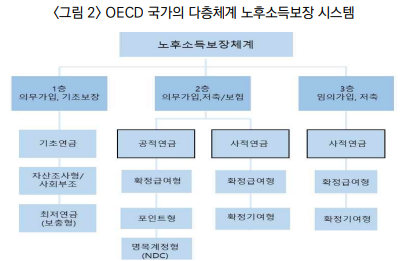

# 퇴직연금의 준공적연금화 필요성과 방안에 관한 연구

양재진(연세대학교 행정학과)

## I. 서론

- 한국은 초고령사회로 진입하고 있다
  - 2025년 한국의 65세 이상 고령인구가 총인구의 20%
  - 2060년이 되면 생산인구 1명이 노인 1명을 부양해야 함
- 일본을 보면 한국의 미래를 엿볼 수 있다
  - 일본의 경제성장의 정체로 인해 조세수입은 증가하지 못하는데, 사회지출의 대부분을 차지하는 연금과 의료 지출은 계속 늘고 있다.
  - 멈추지 않는 재정적자는 GDP 대비 250%가 넘는 국가채무로 이어지고 있다.
- 40년 후면 한국이 일본보다 더 심한 초고령 국가가 된다
  - 인구의 반을 차지하는 고령인구에 대한 적절한 소득보장 여부가 대한민국 국민의 삶의 질에 커다란 영향을 미치게 된다
  - 현재 국민연금과 기초연금의 재정구조는 세대 간 소득이전 방식을 취하고 있다.
    - 국민에게 약속된 국민연금 급여(소득대체율 40%)를 지급하기 위해서는 연금보험료율이 현행 9%에서 2060년에는 29.3%로 인상되어야 할 것이다.
- 인구고령화를 먼저 경험한 스웨덴, 독일 등 많은 국가에서는 노후소득보장의 총비용에 한계를 설정하고, 다층체계 하에서 비용부담을 다변화하는 노력을 기울이고 있다.
  - 큰 틀에서 공적연금의 급여 삭감 등을 통해 재정적 지속가능성을 확보하고, 부족할 수 있는 노후소득은 사적연금을 통해 보완하고 있다.
  - 스웨덴과 호주는 개인별 사적연금 가입이 의무화 되어 있다.
  - 독일은 정액 보조금 지급을 통해 저소득층을 포함해 개인연금의 가입을 유인하고 있다.
  - 스위스, 덴마크, 네덜란드 같은 나라는 기초연금만 국가가 운영하고, 직역연금과 직업연금이 다른 나라의 공적연금과 같은 역할을 한다.
- 한국은 사용자가 1년 이상 근속하는 근로자에게 퇴직금 혹은 퇴직연금을 지급해야 한다.
  - 그러나 퇴직연금은 연금으로서의 기능을 못하고 있다.
  - 대부분 은퇴 시 연금이 아닌 일시금으로 수령하고 있기 때문이다.
  - 한국의 퇴직연금제도는 다른 OECD 국가의 기업연금과 달리 연금이 아닌 사외적립형 퇴직금처럼 사용되고 있다.
- 본 연구는 초고령사회를 맞이하여 노후소득보장의 다층체계 안에서 퇴직연금의 준공적연금화(의무화+연금화)의 필요성을 논하고 실행 방안을 제시하고 있다.
  - 즉, 퇴직연금이 국민연금과 더불어 노후소득보장제도로 기능할 수 있는 방안을 찾는 것이다.
  - 퇴직연금의 '의무화'를 통해 퇴직연금의 사각지대를 없애고 모든 1년 이상 재직근로자가 퇴직금이 아닌 퇴직연금에 가입하게 만든다.
  - 퇴직연금의 '연금화'란 퇴직연금 수급을 일시금이 아닌 연금으로 받게 하여, 국민연금의 낮은 급여를 보완하게 한다.
  - 퇴직연금의 가입자가 크게 늘고 또 퇴직급여의 연금화로 퇴직연금이 고령 은퇴자의 노후소득원으로 작동하게 되면, 국민연금의 재정안정화 조치도 가능하게 된다.
  - 퇴직연금과 지속가능성이 높아진 국민연금을 통해 중간계층에게 적절한 노후소득이 보장되면, 국가의 가용자원은 국민연금의 적자를 메우는 데 소진하는 것이 아니라 저소득 노인의 기초소득보장에 더 크게 쓰일 수 있을 것이다.

## II. 한국 노후소득보장 환경 변화와 현행 다층체계의 문제점

### 1. 인구구조 변화, 잠재성장률 및 복지재정의 한계

#### 1) 인구구조의 변화

- 한국의 인구는 2020년 5,183만명을 정점으로 2021년부터 감소하기 시작해 2070년에는 3,153만명까지 줄어들 것으로 전망된다.
  - 15세 미만 유소년인구는 631만명에서 282만명으로 절반이 넘게 감소
  - 15세에서 64세 생산연령인구는 3,738만명에서 1,737만명으로 총인구 대비 72.1%에서 46.1%로 급감
  - 65세 이상 노령인구의 비율은 15.7%에서 46.4%로 30%p 이상 증가

#### 2) 잠재성장률 하락과 국가재정의 장기전망

- 2012년 이후 경제성장률은 연평균 3% 이하로 떨어졌다. 이후 계속 하락해 2019년에는 2% 대로 떨어졌다.
  - 성장률 하락 추세는 장기적으로 이어질 것으로 예상된다.
  - 한국개발연구원(KDI)은 2030년대 한국경제의 잠재성장률을 1%대, 2050년대는 1.1% 수준에 불과할 것으로 예상하고 있다.
- 보건복지부의 제4차 중장기 사회보장 재정추계에 따르면, 현재의 제도 변화가 없어도 인구고령화와 함께 연금, 의료, 노인요양 등 고령화 관련 복지지출이 크게 증가하여, 2020년 현재 GDP의 8.3%인 것이 2040년에는 15.6%, 2050년에는 20%, 2060년에는 23.2%로 크게 늘어난다.
- 국회예산정책처는 현행 복지제도와 조세제도가 그대로 유지되면, 고령화 관련 복지지출의 증가로 인해 국가채무가 2050년에 GDP대비 100%를 넘고, 2060년에는 160%에 달하게 될 것으로 전망한다.
- 우리의 급속한 인구고령화와 경제성장의 둔화 때문에 노령인구 부양에 대한 생산인구의 부담이 매우 클 것이라는 점은 변하지 않는다.

### 2. 노후소득보장의 다층체계와 한국의 문제점

#### 1) OECD국가의 다층체계 하 노후소득보장

- 1980년대 들어 세계은행(World Bank), 국제노동기구(ILO), OECD 등의 국제기구들은 연금의 3대 기능(생애주기 저축, 장수의 위험에 대한 보험, 기초보장)이 보다 효과적으로 발휘될 수 있도록 다층제로 만들어 연금제도 간 기능과 역할을 명확히 할 것을 권고하고 있다.
- 고령화 사회에서, 세대간 이전방식인 부과방식과 확정급여 방식에 기초한 전통적인 공적연금의 재정적 지속가능성을 확보하기 위해서 급여 인하와 수급연령 인상 등이 불가피하다.
  - 이로 인한 소득보장 기능의 약화는 사적연금의 의무화 혹은 활성화로 보완한다.
  - 그리고 기초보장은 보편주의적 기초연금에서 탈피해 보충급여방식의 최저보장연금이나 사회부조를 활용하여 고령자 빈공방지에 중점을 두는 것이다.
- 실제로 대부분의 OECD 국가들은 1980년대 공적연금의 재정안정화 개혁을 거쳤다.

- 1층에 노인 빈곤 방지를 위한 제도로 사회부조, 기초연금, 최저연금 그리고 보충연금 등을 두고 있다.
- 2층에는 전통적인 확정급여방식의 공적연금이나 구조적으로 재정안정화 장치가 내재된 비적립형 확정기여 혹은 포인트 방식의 공적연금이 자리하고 있다.
  - 그런데, 덴마크, 네덜란드, 호주, 스위스, 칠레 등의 국가는 2층에 공적연금이 아니라 의무가입 혹은 사실상 의무가입의 사적연금을 두고 있다. 이들 사적연금은 개인연금방식으로 운영되거나 업종별/산업별 직역연금 혹은 기업단위 기업연금으로 운영된다.
    - 적용률은 보통 70~80%를 넘고, 일시금이 아닌 연금 형태로 급여가 지급된다.
    - 공적연금에 버금가는 준공적연금이라 할 수 있다.

#### 2) 한국 다층체계 노후소득보장의 문제점: 퇴직(연)금을 중심으로

- 한국의 노후소득보장제도는 다층구조를 띄고 있다. 그러나 층별로 기능 분리가 제대로 되어 있지 못하다.
- 국민연금과 달리 기여가 필요 없는 1층의 기초연금은 국민연금의 사각지대에 있는 저소득 노인의 소득을 보장해주어야 한다.
  - 그러나 기초보장이 필요한 빈곤선 이하 저소득 노인을 넘어 전체의 70% 노인에게 (준)보편주의적으로 지급하다 보니, 1인당 급여가 높지 못하다.
- 2층의 국민연금에는 저축기능과 보험기능 그리고 소득재분배 기능이 혼재되어 있다.
  - 소득재분배 기제 때문에 평균 소득 이상 가입자의 실효 소득대체율은 크게 떨어진다.
  - 국민연금의 재정적 지속가능성에도 문제가 크다.
    - 2018년에 실시된 제4차 국민연금재정추계에 따르면, 국민연금은 2057년에 고갈된다.
    - 연금지급에 필요한 부과방식 보험료율은 2060년에 29.3%, 2080년에는 37.7%로 추정된다.
- 한국에도 3층에 서구의 법정(혹은 의무) 사적연금에 해당하는 퇴직연금이 있다.
  - 한국의 퇴직(연)금은 OECD로부터 연금으로 인정받고 있지 못하다. 이름만 '연금'일 뿐 사외적립식 퇴직금처럼 이용되고 있기 때문이다.
    - 2019년 현재, 퇴직연금은 수령액 기준으로는 73.7%, 계좌 기준으로 97.3%가 연금이 아닌 일시금 형태로 퇴직급여를 수령하고 있다.
  - 퇴직연금은 사각지대도 넓다.
    - 2020년 현재 퇴직연금은 가입대상 근로자 1186.5만명 중 621.9만명이 가입해, 가입률은 52.4%에 머물고 있다.
- 국민연금과 비교해 볼 때, 퇴직연금은 두 가지 단점을 갖고 있다.
  - 첫째, 퇴직연금의 수익률이 크게 낮다.
    - 5년간 연평균 수익률이 1.76%에 불과하다.(10년간 연평균 수익률은 2.81%)
    - 국민연금의 5년간 연평균 수익률인 5.18%에 크게 못미친다.
  - 둘째, 퇴직연금은 국민연금에 비해 수수료(총비용부담률)도 높다.
    - 2018년 민간 퇴직연금사업자의 총비용부담률은 0.4~0.49%이다. 근로복지공단의 0.15%나 국민연금의 0.08~0.23%에 비해 현저하게 높다.
- 현재의 퇴직연금은 국민연금에 버금가는 보험료가 매년 투입됨에도 국민연금에 비해 수익률은 크게 낮고, 수수료는 수배 높다. 게다가 사각지대도 넓고 일시금 위주로 퇴직금처럼 활용된다. 퇴직연금은 노후소득보장제도로서 큰 잠재력을 갖고 있다. 그러나 실제 효과성은 크게 떨어진다.

## III. 퇴직연금의 준공적연금화 필요성과 해외 사례

### 1. 퇴직연금의 준공적연금화 필요성

- 서구의 앞선 복지국가처럼 2층의 국민연금과 함께 3층의 사적연금이 중간소득 이상 가입자의 급여 적절성을 보완해주고, 1층의 기초연금이 저소득층의 노후소득보장에 기여할 수 있도록 개혁을 이루어야 한다.
- 이때 퇴직연금의 준공적연금화가 매우 중요하다.
  - 여기서 준공적 연금화란 i) 퇴직금에서 퇴직연금으로의 전환을 단계적으로 '의무화'하고, ii) 퇴직연금 급여는 단계적으로 일시금이 아닌 '연금' 형태로 받도록 하는 것을 의미한다.
- 퇴직연금이 연금으로서 정상화 되면, 국민연금의 재정안정화 조치로 인한 연금급여 하락을 보완할 수 있게 된다.

#### 1) 국민연금에 버금가는 기지출비용의 노후소득보장재원 활용

- 문제는 퇴직연금에 납부되는 한 해 34.1조원의 막대한 재원이 노후소득보장에 쓰이지 않고 있다는 것이다.
- 이름만 연금일 뿐이고 실제로는 사외적립형 퇴직금인 것이다.
  - 이직할 때 혹은 같은 직장이라도 중간정산으로 일시금으로 받고, 은퇴시에도 대부분 마찬가지로 일시금으로 받는다.
  - 잦은 목돈 수급으로 은퇴 시 퇴직연금 자산규모가 얼마 되지 않아 퇴직급여를 연금으로 수령할 유인이 떨어지게 된다.
  - 제도개혁이 없다면 이러한 행태는 쉽게 바뀌지 않을 것이다.

#### 2) 사각지대의 축소 및 미래 재정 지출 통제

- 퇴직연금 가입률은 의무가입대상자 대비 50%에 머물고 있고, 퇴직연금 가입자는 국민연금의 직장가입자 1400만명의 40% 수준 밖에 안된다.
  - 퇴직연금의 가입대상자나 국민연금의 직장가입자나 서로 본질적으로 다르지 않다. 그럼에도 불구하고, 가입률에 큰 차이가 나는 것은 적용의 '의무화'여부이다.
- 국가는 퇴직연금의 준공적연금화와 적용제외자의 가입 유도를 통해, 새로운 큰 비용부담 없이 노후소득보장을 크게 강화할 수 있다.
  - 퇴직연금의 준공적연금화로, 적어도 중간계층 이상의 노인의 소득보장 문제는 해결될 수 있다.
  - 국가의 미래 가용자원은 개혁이 없을 때보다 훨씬 커질 것이다.

### 2. 해외 사적연금의 준공적연금화 사례

#### 1) 네덜란드 직역연금

- 네덜란드는 1층에 기초연금이 있고, 2층에 산업별 직역연금이 준공적연금으로서 우리나라의 국민연금 역할을 하고 있다.
  - 직역연금은 우리와 같은 신탁형이 아니고, 대부분 노사가 직접 운영하는 기금형 연금이다.
  - 1952년 기업연금법의 도입 이후 전체 피용자의 92%가 직역연금에 적용될 정도로 보편화되었다.(자영자는 제외)
- 직역연금의 소득대체율은 기초연금과 합하여 총 70%를 목표로 조정된다.
  - 평균적으로는 1층 기초연금이 32.6%, 2층 직역연금이 37.4% 수준
  - 직역연금의 보험료는 8~25% 수준(평균 16.1%)이며, 고령화에 따라 지속적으로 인상되는 추세
  - 보험료 부담은 사용자와 근로자가 약 2:1 비율로 분담
  - 소액인 경우를 제외하고는 일시금 지급을 금지해서 연금 형태로만 지급받을 수 있음

#### 2) 덴마크 직역연금

- 덴마크의 직역연금은 완전적립의 기금형 확정기여 방식 연금이다.
  - 2018년 현재 임금근로자의 85% 가량이 직역연금에 가입되어 있다.
  - 보험료는 보통 임금의 10%에서 18% 사이에서 결정된다.
  - 원칙적으로 급여는 종신형 연금으로 받는다.

#### 3) 스위스 기업연금

- 스위스는 1층에 보험료를 재원으로 하나 재분배 성격이 강한 소득비례연금을 두고 있으며, 2층의 기업연금을 법정 의무제도로 운영하고 있다.
  - 1층의 소득비례연금은 누진성이 강해 기초연금이라 보아도 무방하다.
  - 2층의 기업연금은 1960년대부터 노사합의로 도입되기 시작하였고, 1985년에 법정 의무화되었다. 신탁형이나 기금형이 모두 가능하다.
    - 일부 저소득자를 제외하고, 근로자의 80% 이상이 가입되어 있는 보편적 연금이다.
    - 연령에 따라 의무보험료율이 다르다. 
      - 25~35세는 7%, 35~45세는 10%, 45~55세는 15%, 55~65세는 18%가 최소보험료율이다.(노사 반반씩 부담)

#### 4) 스웨덴 프리미엄 연금

- 스웨덴은 1999년 연금 대개혁을 통해 <1층 보편주의적 기초연금 + 2층 소득비례 공적연금> 에서, 2층의 소득비례연금을 명목확정기여(NDC)연금으로 전환하고, 완전적립방식의 DC형 프리미엄 연금을 3층에 새로 신설해 얹는 구조개혁을 단행하고, 1층의 기초연금은 선별주의의 기초소득보장연금으로 바꾸었다.
- 총연금보험료율은 과세소득의 18.5%로 고정되었다. 법에 의해 더 이상의 연금보험료 인상은 불가하다.
  - 연금보험료율 18.5% 중 16%는 NDC 소득연금으로 나머지 2.5%는 개인투자계정방식으로 운영되는 프리미엄연금에 납입된다.
  - NDC 소득연금은 부과방식으로 운영되어 개인별로 연금자산이 축적되지 않는 반면, 프리미엄연금은 완전적립방식이기에 연금계좌에 개인별로 연금자산이 축적되고 투자수익이 이자로 가산된다.
- 스웨덴은 공공기관인 스웨덴연금청(Swedish Pensions Agency)에서 프리미엄연금의 보험료 관리와 연금지급 업무를 통합적으로 관리한다.
  - 가입자는 2018년 현재 800개가 넘는 운영펀드 중 하나를 선택할 수 있다.
  - 선택하지 않는 경우 공적으로 운영되는 프리미엄 저축펀드에 자동 가입된다.(소위 Default Option)

## IV. 한국 퇴직연금의 준공적연금화 방안

### 1. 현행 퇴직연금의 의무화 및 연금화

### 2. 국민연금공단의 퇴직연금사업 참여(Public Option안)

### 3. 퇴직(연)금의 기여비례형 제2국민연금화

## V. 결론
